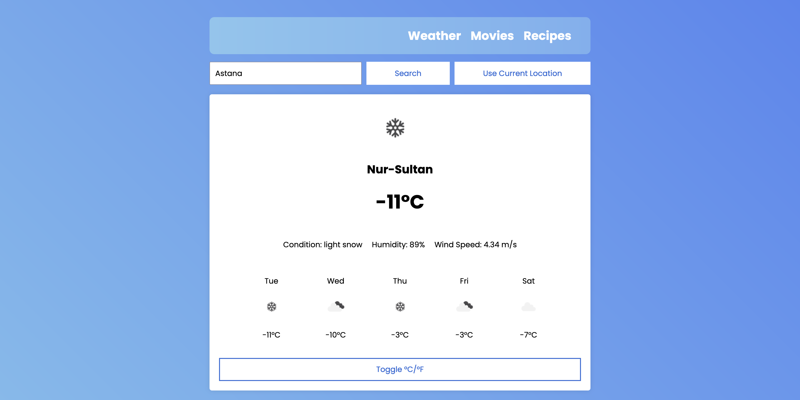

# inf-316-midterm-2
### Information
Name Surname: `Adilzhan Slyamgazy` <br>
Student ID: `220103151` <br>
Email: `220103151@stu.sdu.edu.kz` <br>
Telegram: `@herztard`


### 1. Weather App
- **Description**: Allows users to search for current weather conditions and a 5-day forecast for any city or their current location.
- **Features**:
    - Search for weather by city name.
    - Use your current location for weather updates.
    - Displays current conditions and upcoming forecasts.
    - Switch from celsius to fahrenheit and vise versa
- **Screenshots**:
  
  
  
  

### 2. Movies App
- **Description**: Helps users discover movies, sort them by various criteria, and maintain a personal watchlist.
- **Features**:
    - Search for movies using a keyword.
    - Sort results by popularity, release date or rating.
    - Watch trailer and other details about movie.
    - Add and remove movies to a personal watchlist.
- **Screenshots**:
  
  
  


### 3. Recipes App
- **Description**: Provides an easy way to search for recipes and save favorites for future reference.
- **Features**:
    - Search for recipes by name or ingredient.
    - View recipe details and instructions.
    - Save and remove favorite recipes to a list.
- **Screenshots**:
  
  
  

---

## Running the Applications

To run the applications locally:

1. Clone this repository:
   ```bash
   git clone https://github.com/herztard/inf-316-midterm-2.git
